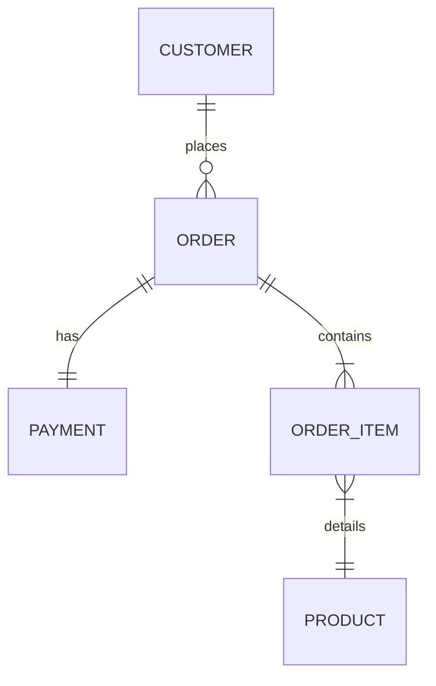

# Architecture Design (Section 1: Performance Optimization)

This document outlines the architectural decisions and database designs adopted to isolate, diagnose, and resolve the performance bottleneck in the orders dashboard API.

## 1. Database Schema Design

The schema is modeled using standard normalized entities to model an e-commerce order process:

### Entities:
1. **`Customer`**: Stores profile information and buyer segmentation (tiers: `REGULAR`, `GOLD`, `PLATINUM`).
2. **`Product`**: Product catalog listing pricing and SKUs.
3. **`Order`**: Order header referencing the customer placing the order.
4. **`OrderItem`**: Line-items representing the specific products, quantities, and the historical snapshot price at the time of purchase.
5. **`Payment`**: Single-record payment info associated with the order (`OneToOneField` relation).

---

## 2. Framework & Profiling Setup Decisions

1. **Django REST Framework (DRF)**:
   - Chosen for its robust serialization layers.
   - Provides clear separation between the view queryset logic and the presentation layer, allowing us to highlight how query configurations in the view resolve N+1 patterns without changing serializer field declarations.

2. **Django Silk**:
   - Integrated as diagnostic middleware.
   - Positioned as the topmost middleware in `settings.py` (`silk.middleware.SilkyMiddleware`) to ensure it intercepts database operations and calculates exact request lifetimes.
   - Disabled query execution plans (`SILKY_ANALYZE_QUERIES = False`) in test/CI configurations to avoid doubling query counts via SQLite explain loops.

3. **In-Memory Caching (ORM level)**:
   - Used `select_related` for immediate single-query joins of single-valued relations (`customer`, `payment`).
   - Used `prefetch_related` with a custom `Prefetch` object for multi-valued relations (`items`), executing a secondary query joined with product metadata to load all items into Django's internal prefetch cache in exactly one database roundtrip.

---

## 3. Section 2: Rate-Limited Async Job Queue Design

### Technology Selection: Celery + Redis vs. Alternatives
1. **Celery + Redis (Chosen):**
   - *Pros:* Industry standard for Django. Native support for complex retry strategies, concurrency models, task serialization, and robust message routing. Redis acts as an extremely low-latency in-memory message broker.
   - *Cons:* Requires running a separate Celery worker process and a Redis server (increased infra footprint).
2. **Django Q (Alternative):**
   - *Pros:* Integrates closely with Django ORM; schedules can be stored in the database.
   - *Cons:* Higher database write/read overhead when using Django ORM as broker; slower execution loops under high burst loads.
3. **Custom Implementation (Alternative):**
   - *Pros:* Minimal footprint; no heavy dependencies.
   - *Cons:* High wheel-reinvention cost for retry backoff, multi-threaded worker concurrency, dead-letter storage, and socket management.

### Rate Limiter: Sliding Window vs. Alternatives
We implemented a **Sliding Window Rate Limiter** using Redis sorted sets (`ZSET`).
1. **Why Sliding Window?**
   - Unlike **Fixed Window** (which allows up to double the rate limit at window boundaries: e.g., 200 requests at 11:59:59 and 200 at 12:00:01), Sliding Window strictly enforces that in *any* rolling 60-second window, no more than 200 emails are processed.
   - Unlike **Token Bucket**, it is simpler to manage in Redis without having to constantly calculate fractional token replenishments based on CPU timestamp deltas.
2. **Atomicity Guarantee (Lua Scripting):**
   - A standard MULTI/EXEC transaction block can execute operations atomically but cannot perform intermediate checks (like "read request count and conditionally abort").
   - By compiling and executing a **Lua Script**, Redis runs the entire operation (deleting expired logs, checking remaining slots, and adding the new log) as a single, blocking, atomic thread execution. No other Redis client can insert a request between the `ZCARD` read and the `ZADD` write.
3. **Redis Failure Mode Strategy:**
   - *Fail-Closed (Production Standard for Rate Limits):* If Redis fails, the rate limiter raises a connection exception. In our setup, this error is caught and causes the Celery task to retry. This is a **fail-closed** design protecting downstream SMTP servers from being overwhelmed and blacklisted.

---

## 4. Section 4: Multi-Tenant Data Isolation Design

- **ORM-Level Scoping:** We override the default `get_queryset()` on a custom `TenantManager` class linked to `Order`. Any ORM query (`Order.objects.all()`, `Order.objects.filter(...)`) automatically scopes database execution to `tenant_id = current_tenant`.
- **Fail-Closed Security:** If no tenant context is actively bound in the event loop (e.g. `current_tenant_id is None`), the manager returns `self.none()`. This ensures that a bug in middleware or an unauthenticated request never leaks data across tenants by default.
- **Request Context Security (`ContextVar`):** Rather than using standard `threading.local` (which leaks data in async view event loops where multiple requests share threads), we leverage Python's `contextvars.ContextVar`. This guarantees logical isolation per async task execution context.
