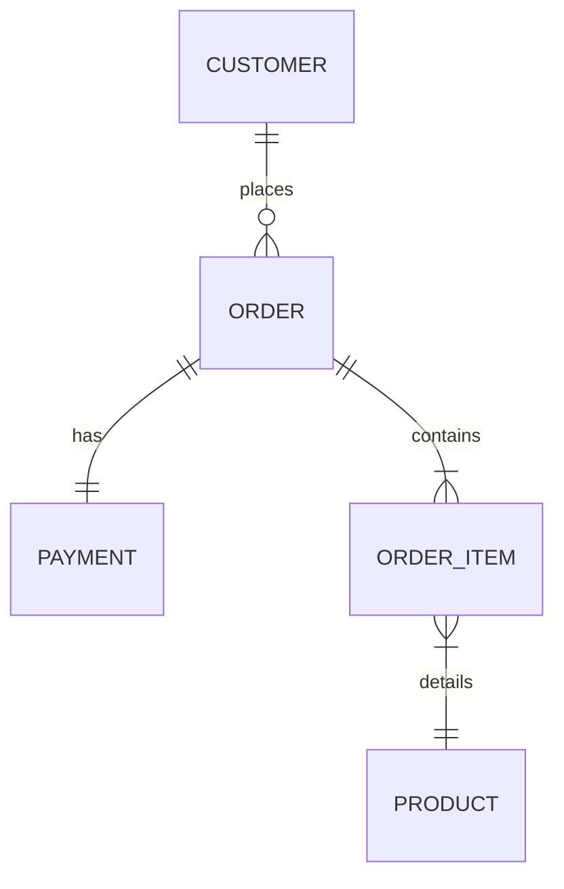

# Architecture Design (Section 1: Performance Optimization)

This document outlines the architectural decisions and database designs adopted to isolate, diagnose, and resolve the performance bottleneck in the orders dashboard API.

## 1. Database Schema Design

The schema is modeled using standard normalized entities to model an e-commerce order process:

### Entities:
1. **`Customer`**: Stores profile information and buyer segmentation (tiers: `REGULAR`, `GOLD`, `PLATINUM`).
2. **`Product`**: Product catalog listing pricing and SKUs.
3. **`Order`**: Order header referencing the customer placing the order.
4. **`OrderItem`**: Line-items representing the specific products, quantities, and the historical snapshot price at the time of purchase.
5. **`Payment`**: Single-record payment info associated with the order (`OneToOneField` relation).

---

## 2. Framework & Profiling Setup Decisions

1. **Django REST Framework (DRF)**:
   - Chosen for its robust serialization layers.
   - Provides clear separation between the view queryset logic and the presentation layer, allowing us to highlight how query configurations in the view resolve N+1 patterns without changing serializer field declarations.

2. **Django Silk**:
   - Integrated as diagnostic middleware.
   - Positioned as the topmost middleware in `settings.py` (`silk.middleware.SilkyMiddleware`) to ensure it intercepts database operations and calculates exact request lifetimes.
   - Disabled query execution plans (`SILKY_ANALYZE_QUERIES = False`) in test/CI configurations to avoid doubling query counts via SQLite explain loops.

3. **In-Memory Caching (ORM level)**:
   - Used `select_related` for immediate single-query joins of single-valued relations (`customer`, `payment`).
   - Used `prefetch_related` with a custom `Prefetch` object for multi-valued relations (`items`), executing a secondary query joined with product metadata to load all items into Django's internal prefetch cache in exactly one database roundtrip.
